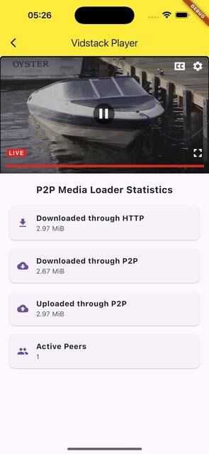
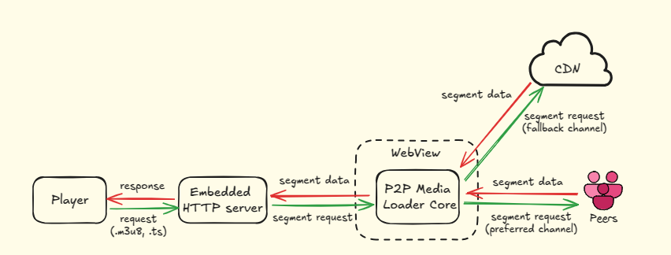

[P2P Media Loader](https://github.com/Novage/p2p-media-loader) by [Novage](https://novage.com.ua) 🇺🇦 is an open-source JavaScript library that leverages modern web browser features to enable media delivery over peer-to-peer (P2P) connections. The library enables the creation of huge P2P mesh networks, also known as peer-to-peer content delivery networks (P2P CDN), peer-to-peer television (P2PTV), and Enterprise Content Delivery Networks (eCDN), which allows traffic sharing among users who are simultaneously viewing the same live or video on demand (VOD) stream via HLS or MPEG-DASH protocols.

In this article, we will showcase the available integration samples for both **iOS** and **Android**, demonstrating how to leverage P2P Media Loader in your mobile applications. Integrations are fully compatible with web-based integration, meaning that whether your users are on the web, iOS, or Android, they all become part of a single, unified peer-to-peer network. As a result, traffic is shared more efficiently across platforms, leading to a larger network of peers, reduced traffic costs, and enhanced streaming performance.

## Flutter Integration (iOS and Android)



In this method, your Flutter application includes a WebView that loads an HTML/JavaScript-based video player. The P2P Media Loader library runs in the WebView context to handle peer-to-peer streaming via WebRTC.

**Pros:**

- **Cross-Platform Capability:** Write once, and deploy on both Android and iOS, reducing development time and effort for multi-platform support.

- **No Native Video Player Dependencies:** By relying on the WebView rather than each platform’s video player, this approach reduces compatibility issues and streamlines maintenance.

**Cons:**

- **Limited Native Feature Support:** Certain platform-specific features (e.g., Picture-in-Picture, casting, DRM, advanced hardware acceleration, or certain OS-level optimizations) may not be directly accessible or as seamless as with a native player.

- **Less Control Over Player Lifecycle:** Integrating deeper with the OS-level media controls (lock screen controls, Bluetooth headset events, or background playback) can be more involved than with a native player.

- **Complex Debugging:** Troubleshooting playback issues, network behavior, or UI glitches can be more challenging because you have two layers of code: Flutter (Dart) and the embedded web content (HTML/JavaScript).

- **Cross-Layer Interactions:** When integrating a WebView-based player within a Flutter app, coordinating playback events and controls across Dart and JavaScript can become more complex.

To setup a video player with P2P Media Loader in a WebView you need:

### 1. Add the WebView Dependency

We'll use [InAppWebView](https://inappwebview.dev/docs/webview/in-app-webview/) in our Flutter example. Update your **pubspec.yaml** with:

```yaml
dependencies:
  flutter_inappwebview: ^6.1.5
```

### 2. Prepare an HTML File with a Player & P2P Media Loader

We need an HTML file that includes:

- A video player (in this example, the Vidstack player with HLS.js).
- P2P Media Loader to enable peer-to-peer streaming.

Below is a minimal example of an index.html file you can store in your project’s assets folder. This file uses the Vidstack player and configures the P2P engine if it’s supported on the device.

```html
<!DOCTYPE html>
<html lang="en">
  <head>
    <script type="importmap">
      {
        "imports": {
          "p2p-media-loader-core": "https://cdn.jsdelivr.net/npm/p2p-media-loader-core@^2/dist/p2p-media-loader-core.es.min.js",
          "p2p-media-loader-hlsjs": "https://cdn.jsdelivr.net/npm/p2p-media-loader-hlsjs@^2/dist/p2p-media-loader-hlsjs.es.min.js"
        }
      }
    </script>

    <link rel="stylesheet" href="https://cdn.vidstack.io/player/theme.css" />
    <link rel="stylesheet" href="https://cdn.vidstack.io/player/video.css" />
    <script src="https://cdn.jsdelivr.net/npm/hls.js@~1/dist/hls.min.js"></script>

    <style>
      html,
      body {
        margin: 0;
        padding: 0;
      }
    </style>
  </head>
  <body>
    <div id="player"></div>
  </body>

  <script type="module">
    import {
      VidstackPlayer,
      VidstackPlayerLayout,
    } from "https://cdn.vidstack.io/player";

    const isP2PSupported =
      HTMLScriptElement.supports("importmap") && Hls.isSupported();

    let HlsWithP2P;
    if (isP2PSupported) {
      const { HlsJsP2PEngine } = await import("p2p-media-loader-hlsjs");
      HlsWithP2P = HlsJsP2PEngine.injectMixin(window.Hls);
    }

    const player = await VidstackPlayer.create({
      target: "#player",
      src: "https://fcc3ddae59ed.us-west-2.playback.live-video.net/api/video/v1/us-west-2.893648527354.channel.DmumNckWFTqz.m3u8",
      crossOrigin: true,
      playsInline: true,
      layout: new VidstackPlayerLayout(),
    });

    player.addEventListener("provider-change", (event) => {
      const provider = event.detail;
      if (provider?.type === "hls") {
        provider.library = HlsWithP2P;
      }
    });
  </script>
</html>
```

In your project’s root pubspec.yaml, ensure that the HTML file is declared as an asset:

```yml
flutter:
  assets:
    - assets/index.html
```

**Note:** You can also host this HTML file remotely on a CDN or your own server and load it by URL.

### 3. Create a Flutter Widget with InAppWebView

Below is an example of how to create a simple widget that loads your index.html into the InAppWebView:

```dart
class MainApp extends StatelessWidget {
  const MainApp({super.key});

  void _onWebViewCreated(InAppWebViewController controller) {
    // Load the HTML file from the asset path
    controller.loadFile(assetFilePath: 'assets/index.html');

    // or Load the HTML file from URL
    // controller.loadUrl(
    //   urlRequest: URLRequest(url: WebUri('https://example.com')));
  }

  @override
  Widget build(BuildContext context) {
    return MaterialApp(
      home: Scaffold(
          body: AspectRatio(
              aspectRatio: 16 / 9,
              child: InAppWebView(
                initialSettings: InAppWebViewSettings(
                  javaScriptEnabled: true,
                  allowsInlineMediaPlayback: true,
                  allowUniversalAccessFromFileURLs: true,
                  mediaPlaybackRequiresUserGesture: false,
                  // Enable to debug WebView
                  isInspectable: true,
                ),
                onWebViewCreated: _onWebViewCreated,
              ))),
    );
  }
}
```

For a more extensive example that gathers P2P engine stats and manages P2P state according to app lifecycle, check our [P2P Media Loader Flutter Demo](https://github.com/Novage/p2p-media-loader-flutter-demo).

## Native Android

In this section, we introduce our [native Android library](https://github.com/Novage/p2p-media-loader-mobile) fully compatible with [ExoPlayer](https://exoplayer.dev/), one of the most popular media players for Android. The library is also designed to support other media players with minimal adjustments.

Under the hood, it runs the P2P Media Loader within a hidden WebView and uses a local HTTP proxy to feed the peer-to-peer stream to the native player. This approach enables seamless integration of P2P streaming while preserving the performance and feature set of a fully native media player like ExoPlayer.



**Pros:**

- **Seamless Integration with Android Ecosystem:** Direct access to Android-specific APIs and features, enabling more comprehensive customization and functionality.

**Cons:**

- **Platform-Specific:** The native approach is limited to Android.

- **HLS only:** The integration is currently limited to HLS and doesn't support MPEG-DASH streams.

**Note:** The library is in active development, so the API and features might be changed by the time.

To setup ExoPlayer with peer-to-peer streaming you need:

### 1. Add JitPack to Your Project

To include the P2P Media Loader Mobile library, first, configure **dependencyResolutionManagement** in your **settings.gradle** file:

```kotlin
dependencyResolutionManagement {
    repositoriesMode.set(RepositoriesMode.FAIL_ON_PROJECT_REPOS)
    repositories {
        google()
        mavenCentral()
        maven(url = "https://jitpack.io")
    }
}
```

### 2. Add the Library Dependency

Add the following implementation line to your **build.gradle** (app module):

```kotlin
implementation("com.github.Novage:p2p-media-loader-mobile:main-SNAPSHOT")
```

### 3. Configure the AndroidManifest

Ensure that your app has the necessary permissions and configurations by updating the **AndroidManifest.xml** file:

```xml
    <!-- Add internet access permission -->
    <uses-permission android:name="android.permission.INTERNET" />
```

### 4. Allow Localhost Connections

Create or update the **res/xml/network_security_config.xml** file to allow localhost connections:

```xml
<?xml version="1.0" encoding="utf-8"?>
<network-security-config>
    <domain-config cleartextTrafficPermitted="true">
        <domain includeSubdomains="true">127.0.0.1</domain>
    </domain-config>
</network-security-config>
```

Make sure to reference this file in the **<application>** tag of your **AndroidManifest.xml**.

### 5. Use the Library

Below is a simple example that illustrates how to integrate P2P with ExoPlayer:

```kotlin
class MainActivity : ComponentActivity() {
    companion object {
        // URL to the media manifest
        private const val MANIFEST_URL = "https://test-streams.mux.dev/x36xhzz/x36xhzz.m3u8"

        // JSON configuration for P2P Media Loader
        // See https://novage.github.io/p2p-media-loader/docs/v2.1.0/types/p2p-media-loader-core.CoreConfig.html
        private const val CORE_CONFIG_JSON = "{\"swarmId\":\"TEST_KOTLIN\"}"

        // Port on which the P2P server will run
        private const val SERVER_PORT = 8081
    }

    private lateinit var exoPlayer: ExoPlayer
    private lateinit var p2pml: P2PMediaLoader

    // State variables to manage UI state
    private val isLoading = mutableStateOf(true)
    private val videoTitle = mutableStateOf("Loading Video...")

    override fun onCreate(savedInstanceState: Bundle?) {
        super.onCreate(savedInstanceState)
        enableEdgeToEdge()

        // Initialize ExoPlayer
        exoPlayer = ExoPlayer.Builder(this).build()

        // Initialize P2P Media Loader with callbacks
        p2pml = P2PMediaLoader(
            onP2PReadyCallback = { initializePlayback() },
            onP2PReadyErrorCallback = { onP2PReadyErrorCallback(it) },
            coreConfigJson = CORE_CONFIG_JSON,
            serverPort = SERVER_PORT,
        )

        // Event listeners for P2P Media Loader
        p2pml.addEventListener(CoreEventMap.OnPeerConnect) { params ->
            // Implement logic to handle peer connection
            Log.d("P2PML", "Peer connected: ${params.peerId} - ${params.streamType}")
        }

        p2pml.addEventListener(CoreEventMap.OnSegmentLoaded) { params ->
            // Implement logic to handle loaded segment
            Log.d("P2PML", "Segment loaded: ${params.segmentUrl} - ${params.bytesLength} - ${params.downloadSource}")
        }

        p2pml.addEventListener(CoreEventMap.OnChunkDownloaded) { params ->
            // Implement logic to handle downloaded chunk
            Log.d("P2PML", "Chunk downloaded: ${params.bytesLength} - ${params.downloadSource} - ${params.downloadSource}")
        }

        // Start P2P Media Loader with the activity context and ExoPlayer instance
        p2pml.start(this, exoPlayer)

        // Listener to update UI based on playback state
        exoPlayer.addListener(object : Player.Listener {
            override fun onPlaybackStateChanged(playbackState: Int) {
                if (playbackState == Player.STATE_READY) {
                    isLoading.value = false
                    videoTitle.value = "Big Buck Bunny"
                }
            }
        })

        // Set the Compose UI content
        setContent {
            ExoPlayerScreen(
                player = exoPlayer,
                videoTitle = videoTitle.value,
                isLoading = isLoading.value,
            )
        }
    }

    private fun initializePlayback() {
        val manifest = p2pml.getManifestUrl(MANIFEST_URL)

        val httpDataSource = DefaultHttpDataSource.Factory()
            .setReadTimeoutMs(15000) // Read timeout
            .setConnectTimeoutMs(15000) // Connect timeout

        val mediaItem = MediaItem.fromUri(manifest)
        val mediaSource = HlsMediaSource.Factory(httpDataSource)
            .createMediaSource(mediaItem)

        exoPlayer.apply {
            playWhenReady = true
            setMediaSource(mediaSource)
            prepare()
        }
    }

    private fun onP2PReadyErrorCallback(error: String) {
        // Implement error handling logic here
    }

    override fun onStop() {
        super.onStop()
        // Disable P2P features when the activity stops
        // See https://novage.github.io/p2p-media-loader/docs/v2.1.0/types/p2p-media-loader-core.DynamicCoreConfig.html
        p2pml.applyDynamicConfig("{\"isP2PDisabled\": true}")
    }

    override fun onRestart() {
        super.onRestart()
        // Re-enable P2P features when the activity restarts
        // See https://novage.github.io/p2p-media-loader/docs/v2.1.0/types/p2p-media-loader-core.DynamicCoreConfig.html
        p2pml.applyDynamicConfig("{\"isP2PDisabled\": false}")
    }

    override fun onDestroy() {
        super.onDestroy()
        // Release ExoPlayer resources and stop P2P Media Loader
        exoPlayer.release()
        p2pml.stop()
    }
}
```

More examples are available in the library's [repository](https://github.com/Novage/p2p-media-loader-mobile).

## Testing P2P

P2P (WebRTC) may not connect to the outer world if it runs on an Android emulator due to [network configuration](https://developer.android.com/studio/run/emulator-networking) (NAT). Please test P2P connectivity on real devices.

The simplest way to test is to run an application with integrated P2P on a real device and open our [web demo](https://novage.com.ua/p2p-media-loader/demo) with the same video URL.

## Conclusion

Integrating P2P Media Loader into your mobile application opens the door to a more scalable, cost-efficient, and robust video streaming solution. By leveraging WebRTC and peer-to-peer connections, you can reduce the dependency on traditional CDNs, lower bandwidth costs, and enhance the overall streaming experience for your users.

We encourage you to experiment with these integration techniques, explore real-world scenarios, and tailor the solutions to best fit your project’s needs. For additional examples, troubleshooting tips, and community support, please refer to our [GitHub repositories](https://github.com/Novage) and join the ongoing discussions. If you encounter any issues, have suggestions for improvement, or discover bugs, don't hesitate to report them on our GitHub issue tracker. Your feedback is essential in helping us improve the P2P Media Loader experience for everyone.
